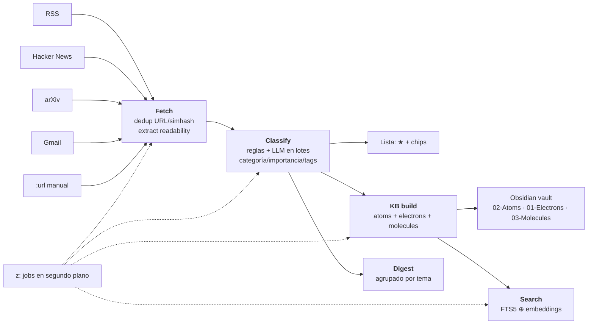

# GizNews — arquitectura

Tres capas, espejo del desktop de giztui. El módulo principal es Go puro (sin
CGO); el desktop es un módulo anidado que solo cruza la frontera pública.

```
internal/services/   ← lógica de negocio (sources, fetch, classify, digest, kb, search, extract, llm)
      ▲
pkg/desktop/         ← API + DTOs JSON (context.Context, sin deps de UI)
      ▲
desktop/             ← módulo Wails anidado (replace → ../) + frontend React/Vite/TS
```

## Pipeline de noticias



```
fetch ──► normalize + agrupar historias (titular/simhash/URL) ──► SQLite
   │
   ├──► extract (batch, readability → markdown, cacheado en content_md)
   │
classify ──► reglas deterministas ⚡ (archive/keep/clasificar) → LLM en batch
             (categoría, importancia, tags, entidades, resumen)
   │
kb build ──► atoms (artículos) + electrons (conceptos, promovidos al superar N
             menciones históricas) + molecules (temas, agrupados por los
             conceptos que las notas nombran juntos) en el vault
   │         y refresca las puertas de entrada: Index.md, Unresolved concepts.md
   │         y la nota del día en 00-Inbox (vistas generadas, no notas del grafo)
   │
digest ──► agrupado por tema + overview LLM (se guarda en la tabla `digests`, uno por día)
   │
search ──► FTS5 (keyword) ⊕ embeddings (Ollama, coseno) con RRF
```

## Historias, no recortes

Seis medios cubriendo el mismo lanzamiento no son seis artículos, y tampoco uno:
son **una historia con seis copias**, y cuántos la recogieron es la señal de
importancia más fuerte que produce el feed. Antes las copias se descartaban en el
ingest, así que esa señal se destruía antes de que nadie pudiera verla.

Ahora se guardan todas. `articles.story_id` apunta a la primera copia que llegó
—0 significa que nadie más la cubrió— y todo lo de aguas abajo trabaja sobre esa
primera copia (`storyAnchor`): la lista muestra una fila, el clasificador ve un
artículo, el vault escribe un atom. Una historia cuesta una unidad de atención,
la cubran los medios que la cubran, pero el atom cita a todos.

El emparejado **no** usa el simhash. El simhash es para documentos: en un titular
de nueve palabras, añadir una sola (`… today`, `… rules`) lo mueve 11-14 bits,
mucho más allá de cualquier umbral que no junte también historias distintas — y
dos redacciones jamás escriben las mismas palabras. Lo que sí comparten dos
crónicas del mismo hecho son los sustantivos, así que `SameStory` compara los
*conjuntos de palabras* del titular (Jaccard, sin las palabras que todo titular
tiene) con dos guardas: un mínimo de palabras compartidas —"Apple lleva la IA al
iPhone" y "…al iPad" se solapan igual que una reescritura real y difieren en la
única palabra que importa— y que las versiones coincidan (GPT-5 no es GPT-4.5).
El simhash se queda para lo que sí sabe hacer: el mismo documento republicado.

Ante la duda, no agrupa: perder un par cuesta una fila duplicada que el lector ve
e ignora; agrupar de más esconde un artículo detrás de otro, donde nadie lo va a
buscar.

## El prefiltro determinista (⚡)

Antes del clasificador caro, cada artículo pasa por las reglas: un regex —
case-insensitive, casado contra `título + autor + URL`— y unas acciones. **Gana
la primera regla que casa**, en orden de id, o sea de creación: el orden *es*
la lógica.

Acciones: `category`, `importance`, `tag`, `archive`, `keep` y `boost`. Las
cuatro primeras resuelven el artículo y **se saltan el LLM**, lo cual tiene un
coste que conviene tener presente: ese artículo se queda sin `summary` y sin
entidades, así que si acaba en el vault su atom no tiene resumen y aporta menos
conceptos. Por eso el set de ruido es casi todo `archive`: matar ruido es
ganancia pura; pre-clasificar es un intercambio.

`keep` existe justamente por el "gana la primera": no aplica nada y manda el
artículo al modelo igual. Es el escudo que se pone **por encima** de las reglas
de ruido para decir qué no pueden tocar — sin él, un regex amplio ("cualquier
cosa sobre cripto") se lleva por delante el único artículo de cripto que
importaba.

`boost` es lo contrario y por el mismo motivo: un suelo de importancia que se
aplica **después** de que el modelo haya clasificado (`applyFloors`), no en su
lugar. Marcar lo bueno con un `importance` normal sería justo al revés —
precisamente los artículos que merecen ★3 son los que más falta les hace un
resumen y unas entidades, porque son los que acaban en la base de conocimiento.
Los boosts no son "primera que gana": se recogen de todas las reglas que casan
(gana el más alto), y un artículo con boost **nunca se archiva**. Todo esto vive
en `classify.Decide`.

Las reglas viven en ficheros versionados (`docs/rules/noise.json`,
`docs/rules/high-value.json`) y se cargan con `giznews rules import <fichero>`,
que empareja por nombre: importar dos veces no duplica nada. `giznews rules test "<regex>"` dice qué artículos de tu
base casarían —la única forma honesta de escribir un regex que archiva— y
`giznews classify --dry-run` dice qué reclamaría cada regla y cuántos quedan
para el modelo, sin tocar nada.

## El flujo de lectura

- **Lista** no leídos con importancia (★ 0-3), chips por categoría, estados.
- **Lazy loading**: al navegar con `j/k` el artículo bajo el cursor carga solo
  (debounce 120 ms) y se prefetchan los adyacentes.
- Extracción **a demanda** si el cuerpo no se extrajo en batch.
- Grafo SVG force-directed con la nota del artículo y sus vecinos (2-hop).

## Contrato de serialización (importante)

Wails serializa las respuestas con `encoding/json` → los **json tags**
(snake_case): `content_md`, `source_name`, `llm_enabled`. El frontend mapea a
camelCase en `src/api.ts#camel()` (acrónimos incluidos: `content_md` →
`contentMD`, `content_html` → `contentHTML`). Los argumentos struct (p. ej.
`ListArticlesOptions`) se envían de vuelta a snake_case (`toSnakeArgs`).

`e2e/real-shape.spec.ts` simula ese wire shape y valida el contrato.

## Base de datos

SQLite con `modernc.org/sqlite` (sin CGO), WAL, `MaxOpenConns(1)`. Migraciones
incrementales por `PRAGMA user_version` en `internal/db/db.go`:
1. schema base (sources, articles, kb_notes, rules, ingests)
2. `articles.classified`
3. `articles.embedding`
4. `sources.hidden` (borrado lógico de fuentes)
5. `articles.extracted` (extracción en batch)
6. `digests` (digest diario persistido, uno por fecha)
7. `kb_links` + `concepts`/`concept_mentions` (grafo relacional: una fila por
   arista y un concepto con sus menciones acumuladas entre ejecuciones; la
   migración rellena ambas desde los `wikilinks` ya escritos)
8. `concepts.canon_key` + `concept_aliases` (una misma idea escrita de varias
   formas —"Open AI"/"OpenAI"— es un solo concepto; los alias explícitos
   cubren lo que la regla no deduce)
9. `kb_notes.content_hash` (huella del fichero que giznews escribió por última
   vez; es lo que distingue una nota intacta de una editada por el usuario)
10. `concepts.definition` + `definition_key` (la prosa del concepto y de qué se
    escribió, para no volver a pedirla en cada build)
11. `kb_themes` (el tema encontrado por el clustering: su concepto semilla, sus
    conceptos, su nota y el resumen con la key de lo que se escribió)

Nota: la numeración real en `db.go` es v7 `articles.starred`, v8 el grafo
relacional, v9 los alias, v10 el hash, v11 las definiciones y v12 los temas — el
orden de merge, no el de diseño.

## El contrato del vault

El vault es un directorio en el que el usuario también escribe, así que una nota
generada delimita la parte que giznews mantiene:

```
---
<frontmatter: las claves de giznews + las que añadas tú>
---
<lo que escribas aquí se respeta>
<!-- giznews:begin -->
… región regenerada en cada build …
<!-- giznews:end -->
<y lo que escribas aquí también>
```

`kb_notes.content_hash` guarda la huella del fichero que giznews escribió. Al
reescribir (`Vault.Sync`):

- fichero ausente → se crea;
- huella igual a la guardada (nadie lo tocó) → se reemplaza entero;
- huella distinta pero con marcadores → **merge**: se refresca solo la región y
  se conservan tu texto, tus propiedades del frontmatter (copiadas literales) y
  tus tags;
- huella distinta y sin marcadores → no se toca; se registra en el log.

Los atoms se refrescan cuando su artículo cambia (`ListStaleNotes`), no una sola
vez al crearse.

Un **electron** no es una lista de backlinks: lleva una definición (escrita por
el LLM cuando está disponible, cacheada en `concepts.definition` y regenerada
solo cuando cambian las notas que la sustentan), la línea temporal de menciones
por mes, los conceptos con los que comparte notas —co-ocurrencia real, no tags—
y sus fuentes.

Una **molecule** es un tema: el grupo de notas que insisten en nombrar los
mismos conceptos juntos. El clustering se hace sobre el grafo de conceptos, no
sobre embeddings —dos notas están juntas porque comparten conceptos, y eso el
grafo ya lo sabe exacto, offline y gratis—. Cada tema se ancla en un concepto
semilla (`kb_themes.seed`), que es lo que le da continuidad: la pertenencia se
recalcula en cada run, pero la nota conserva su slug (`theme-<semilla>`) y su
fecha de creación, así que un rebuild sin cambios no reescribe nada. Una nota
entra en el tema si nombra **al menos dos** de sus conceptos; con uno solo ya
está listada en el electron de ese concepto y la molecule no añadiría nada. La
nota lleva idea central (LLM cuando hay, cacheada en `kb_themes.summary` con su
key), el hilo cronológico de las notas y los conceptos que lo sostienen — nunca
una sección vacía. `kb synth <categoría>` sigue existiendo para el corte manual
por categoría.

Los parámetros del build viven en `kb` dentro de `config.json`
(`min_occurrences`, `age_days`, `limit`, `theme_days`; la importancia mínima
sigue en `classify.importance_threshold`), y `kb build --dry-run` los imprime
junto con lo que el run escribiría — atoms, conceptos que graduarían, temas que
agruparía y notas que refrescaría — sin tocar nada.

Orden dentro de un build, que importa: primero se importan tus notas, luego se
escriben los atoms (que crean conceptos), luego se cuentan las menciones de tus
notas —así una nota tuya puede nombrar algo antes que ningún artículo—, luego se
promueve, y solo al final se agrupan los temas, sobre el grafo ya movido.

Y el camino de vuelta: `kb sync` (también al principio de cada `kb build`) lee
las notas que escribes tú. Un fichero sin marcadores y sin `status: generated`
no es de giznews, así que se importa a `kb_notes` — título, tags, wikilinks — y
sus enlaces a conceptos que ya existen cuentan como menciones, de modo que tus
notas pesan en la promoción igual que los artículos. **Nunca se reescribe**: tu
fichero manda y la base de datos solo guarda una copia y su huella. Un concepto
puede cruzar el umbral sin que ningún artículo del run lo nombre, así que el
build también barre la cola de pendientes.

## Desktop (Wails)

- `desktop/main.go` — bootstrap vía `pkg/desktop.OpenApp()` (nunca `internal/`).
- `desktop/app.go` — wrappers **sin ctx** (Wails no inyecta ctx de forma fiable)
  sobre los métodos de `pkg/desktop`.
- `desktop/frontend/` — React 18 + Vite + TS. `apiMock.ts` da un backend en
  memoria para dev/e2e; `isWails()` elige real vs mock.
- Drag de ventana: `--wails-draggable: drag` en la topbar (custom property de
  Wails v2, no `-webkit-app-region`). Popovers con `position: fixed` via portal
  para no heredar la región drag.

## Temas

Tokens CSS (`--bg`, `--accent`, `--sel-bg`, `--cat-*`, …) por
`[data-theme]` en `desktop/frontend/src/theme.ts` y `styles.css`:
GizNews Dark, Dracula, Slate Blue, Nord, Light.
