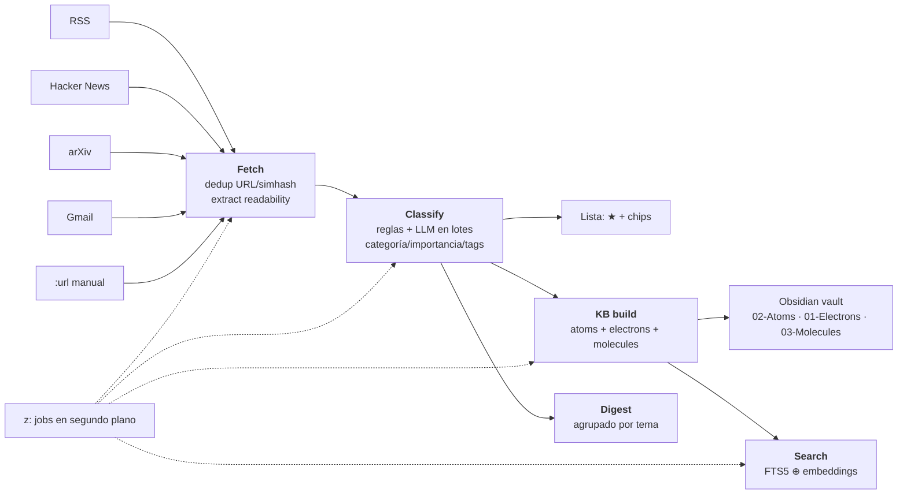

# GizNews — arquitectura

Tres capas, espejo del desktop de giztui. El módulo principal es Go puro (sin
CGO); el desktop es un módulo anidado que solo cruza la frontera pública.

```
internal/services/   ← lógica de negocio (sources, fetch, classify, digest, kb, search, extract, llm)
      ▲
pkg/desktop/         ← API + DTOs JSON (context.Context, sin deps de UI)
      ▲
desktop/             ← módulo Wails anidado (replace → ../) + frontend React/Vite/TS
```

## Pipeline de noticias



```
fetch ──► normalize + dedupe (simhash/URL) ──► SQLite
   │
   ├──► extract (batch, readability → markdown, cacheado en content_md)
   │
classify ──► reglas deterministas ⚡ → LLM en batch (categoría, importancia, tags, entidades, resumen)
   │
kb build ──► atoms (artículos) + electrons (conceptos, promovidos al superar N
             menciones históricas) + molecules (síntesis) en el vault
   │
digest ──► agrupado por tema + overview LLM (se guarda en la tabla `digests`, uno por día)
   │
search ──► FTS5 (keyword) ⊕ embeddings (Ollama, coseno) con RRF
```

## El flujo de lectura

- **Lista** no leídos con importancia (★ 0-3), chips por categoría, estados.
- **Lazy loading**: al navegar con `j/k` el artículo bajo el cursor carga solo
  (debounce 120 ms) y se prefetchan los adyacentes.
- Extracción **a demanda** si el cuerpo no se extrajo en batch.
- Grafo SVG force-directed con la nota del artículo y sus vecinos (2-hop).

## Contrato de serialización (importante)

Wails serializa las respuestas con `encoding/json` → los **json tags**
(snake_case): `content_md`, `source_name`, `llm_enabled`. El frontend mapea a
camelCase en `src/api.ts#camel()` (acrónimos incluidos: `content_md` →
`contentMD`, `content_html` → `contentHTML`). Los argumentos struct (p. ej.
`ListArticlesOptions`) se envían de vuelta a snake_case (`toSnakeArgs`).

`e2e/real-shape.spec.ts` simula ese wire shape y valida el contrato.

## Base de datos

SQLite con `modernc.org/sqlite` (sin CGO), WAL, `MaxOpenConns(1)`. Migraciones
incrementales por `PRAGMA user_version` en `internal/db/db.go`:
1. schema base (sources, articles, kb_notes, rules, ingests)
2. `articles.classified`
3. `articles.embedding`
4. `sources.hidden` (borrado lógico de fuentes)
5. `articles.extracted` (extracción en batch)
6. `digests` (digest diario persistido, uno por fecha)
7. `kb_links` + `concepts`/`concept_mentions` (grafo relacional: una fila por
   arista y un concepto con sus menciones acumuladas entre ejecuciones; la
   migración rellena ambas desde los `wikilinks` ya escritos)

## Desktop (Wails)

- `desktop/main.go` — bootstrap vía `pkg/desktop.OpenApp()` (nunca `internal/`).
- `desktop/app.go` — wrappers **sin ctx** (Wails no inyecta ctx de forma fiable)
  sobre los métodos de `pkg/desktop`.
- `desktop/frontend/` — React 18 + Vite + TS. `apiMock.ts` da un backend en
  memoria para dev/e2e; `isWails()` elige real vs mock.
- Drag de ventana: `--wails-draggable: drag` en la topbar (custom property de
  Wails v2, no `-webkit-app-region`). Popovers con `position: fixed` via portal
  para no heredar la región drag.

## Temas

Tokens CSS (`--bg`, `--accent`, `--sel-bg`, `--cat-*`, …) por
`[data-theme]` en `desktop/frontend/src/theme.ts` y `styles.css`:
GizNews Dark, Dracula, Slate Blue, Nord, Light.
